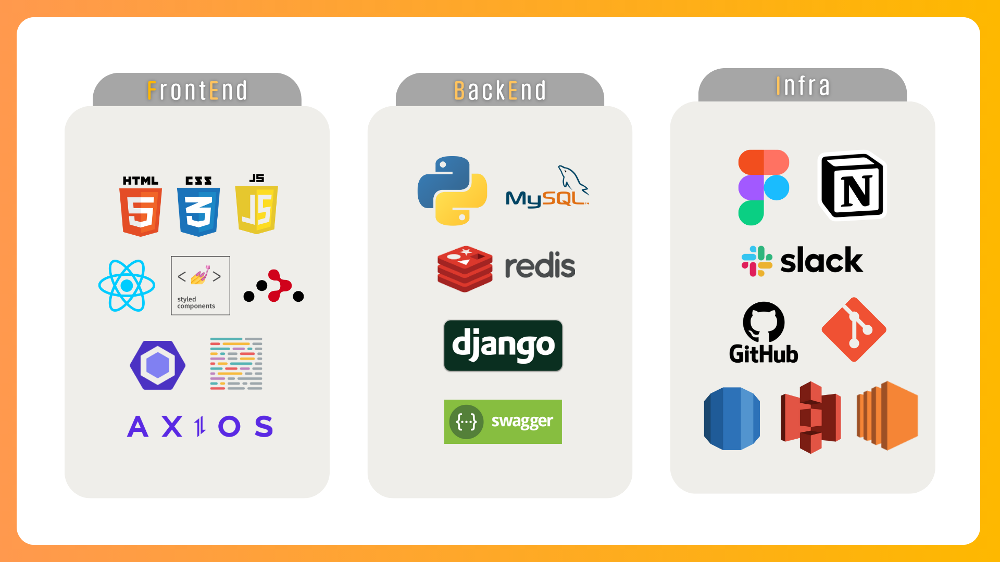
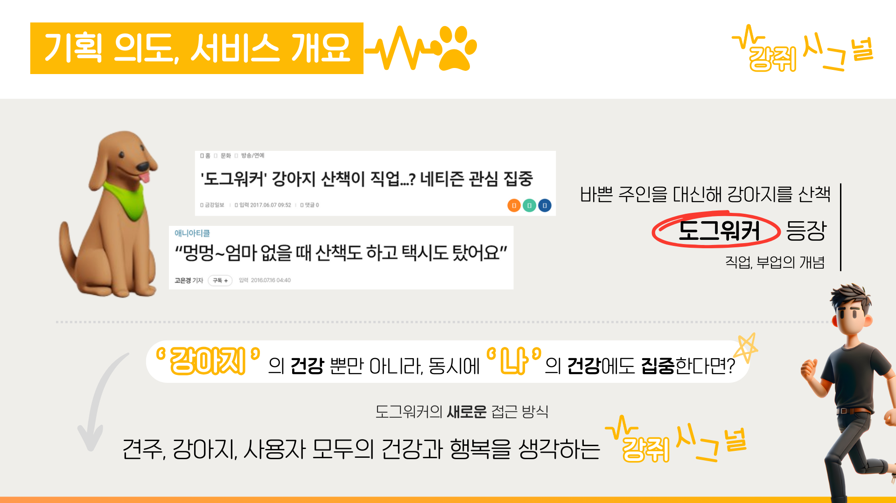
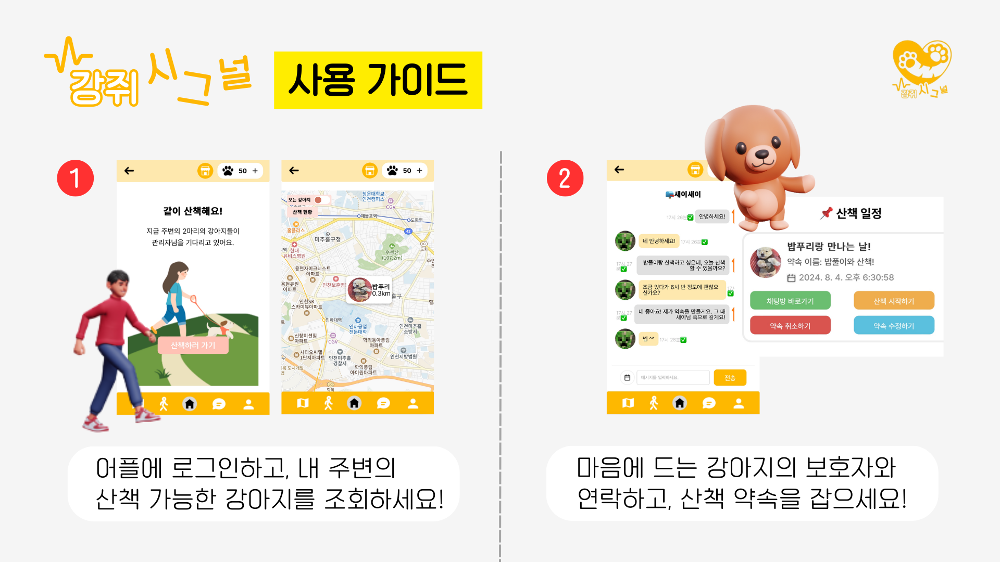
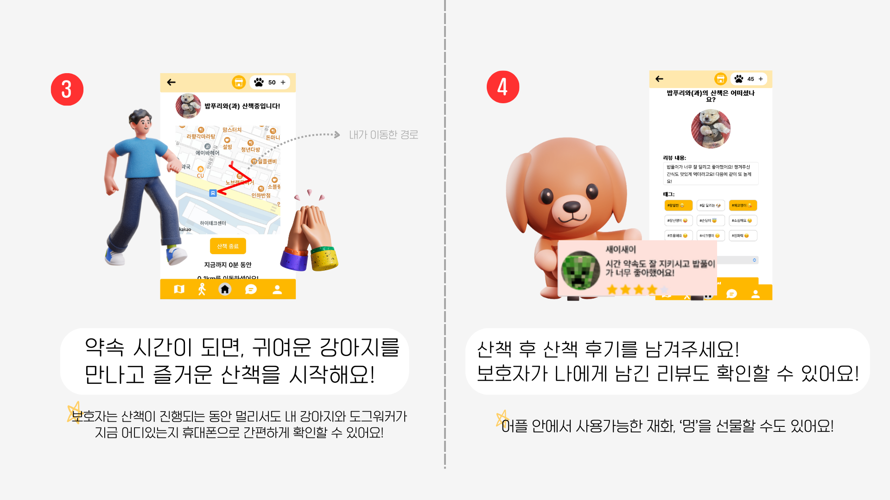
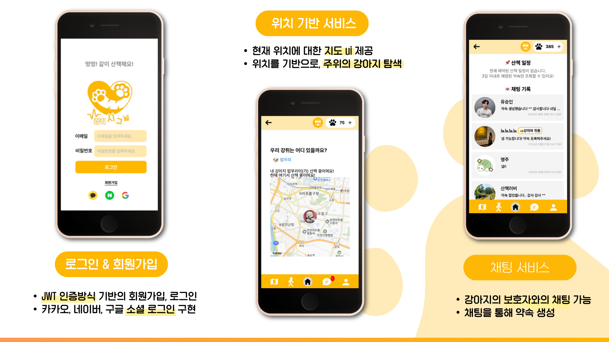
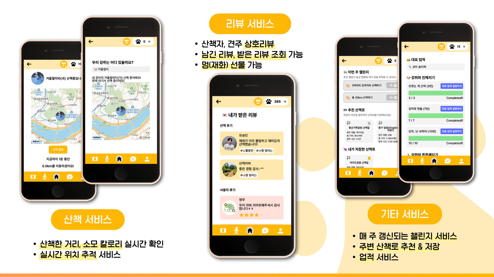
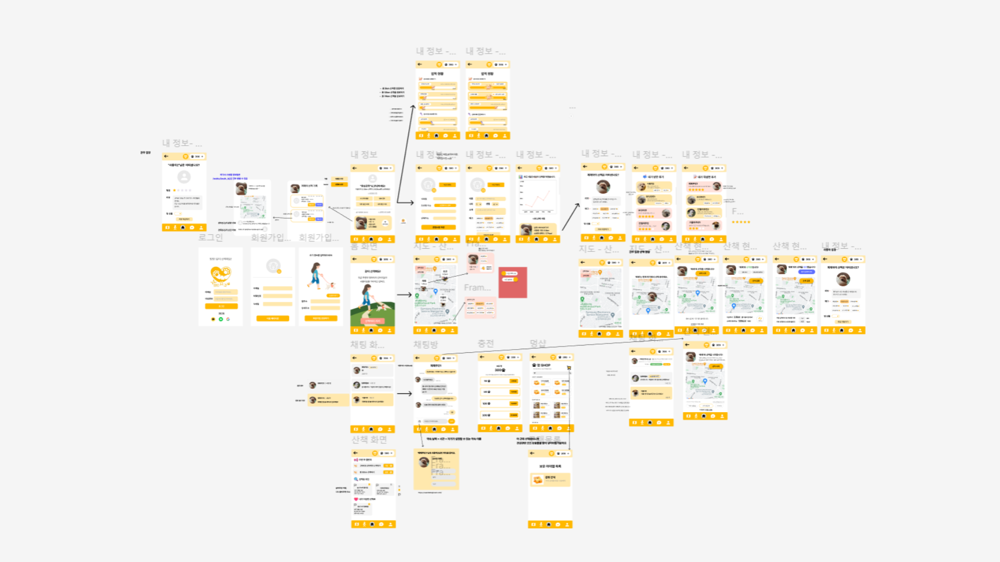
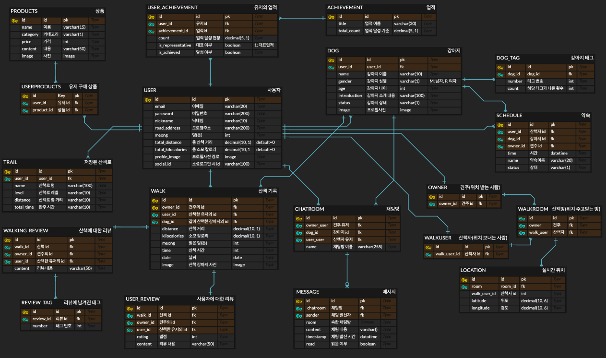
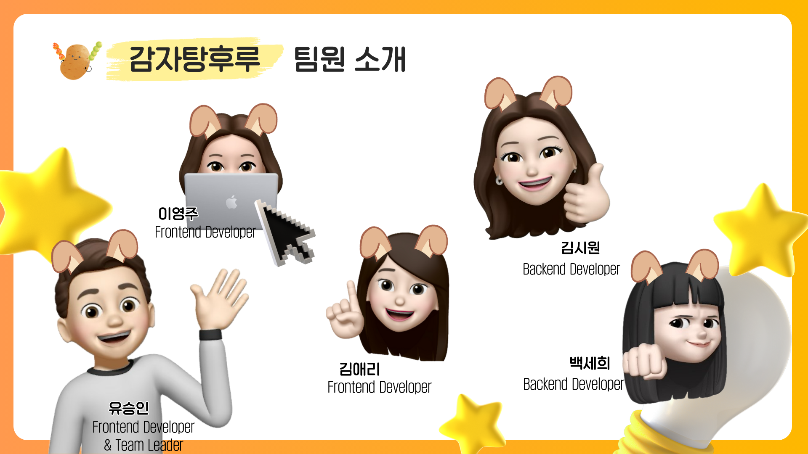
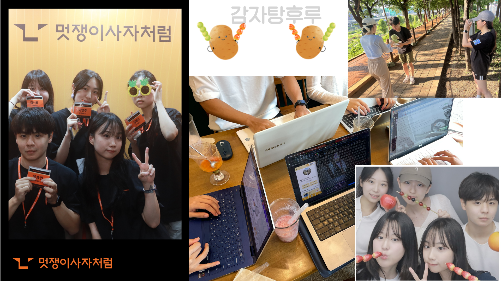

# 🐶 Meong Signal

> Team 감자탕후루 |
> 김시원 김애리 백세희 유승인 이영주


---

**'더 건강하개, 더 재미있개! 당신을 위한 귀여운⭐ 산책메이트, 강쥐시그널'**

---

### [🛠️강쥐시그널 배포 링크 바로가기](https://meong-signal.o-r.kr)

### [🎬강쥐시그널 홍보 영상 바로가기](https://youtu.be/4Iq38YWdS-4?si=wcxGkzFkustVEiyr)

<br>

### 📂 Content

- [🔎 기술 스택](#기술-스택)
- [🔎 서비스 고안 배경](#서비스-고안-배경)
- [🔎 서비스 매커니즘](#서비스-매커니즘-사용-가이드)
- [🔎 주요 기능](#주요-기능)
- [🔎 상세 기능](#상세-기능)
- [🔎 FE 폴더 구조](#FE-폴더-구조)
- [🔎 와이어프레임](#와이어프레임)
- [🔎 데이터베이스 구조](#데이터베이스-구조)
- [🔎 api 명세](#api-명세)
- [🔎 개발 과정](#개발-과정)
- [🔎 팀 소개](#팀-소개)

<br>

## 🛠️기술 스택


<br>

<br>

## 🌟서비스 고안 배경



<br><br>

## 🔗서비스 매커니즘; 사용 가이드




<br>

**⭐ '내'가 강아지의 '도그워커'로써 어플리케이션을 사용할 때!**

> 1. 홈 화면에서 내 주변의 산책 가능한 강아지를 조회합니다.
> 2. 마음에 드는 강아지를 발견했나요? 강아지의 프로필을 클릭하여 보호자와 채팅을 시작합니다.
> 3. 채팅으로 약속을 조율하고, 캘린더 버튼을 눌러 약속을 생성합니다.
> 4. 약속 날짜가 되면 보호자와 컨택하고, 강아지와 산책을 시작합니다! (추천 산책로 서비스를 이용 가능합니다.)
> 5. 산책을 완료하면, 다시 강아지를 보호자에게 돌려 보내고 리뷰를 작성합니다.

<br>

**⭐ '내'가 강아지의 '보호자'로써 어플리케이션을 사용할 때!**

1.  '내 정보' 화면에서 강아지를 등록합니다. (성별, 나이, 성격 등을 설정할 수 있습니다.)
2.  내 강아지의 현재 상태에 따라 '내 정보' 창에서 강아지의 상태를 변경할 수 있습니다!
3.  도그워커에게 채팅이 오면, 약속을 조율하고 약속을 생성 및 확인합니다.
4.  도그워커가 약속 날 산책을 시작하면, '지도' 화면의 '산책현황'에서 내 강아지가 어디 있는지 확인할 수 있습니다.
5.  도그워커의 산책이 끝나면, 도그워커에게 리뷰를 써 주세요!

<br>

## 🔔주요 기능


<br><br>
**🗺️사용자 위치 기반 지도**

- 도그워커의 현재 위치를 기반으로 **주변의 강아지 정보**를 불러옵니다.
- 견주의 집 위치를 기반으로 강아지 정보를 생성합니다.
- 도그워커가 견주의 강아지와 산책 중일 때, 견주는 도그워커의 현재 위치를 원격으로 볼 수 있습니다.
- 도그워커가 **이동한 경로**가 지도에 표시되며, **이동 거리와 소모 칼로리**가 계산됩니다.

---

**💬실시간 채팅**

- 도그워커가 지도에서 강아지의 정보를 확인하고, 견주와 **채팅을 시작**할 수 있습니다.
- 채팅방 안에서 날짜와 시간, 약속명을 설정하여 **약속을 생성**할 수 있습니다.
- 채팅방 목록에서 곧 다가오는 **산책 약속을 확인**할 수 있습니다.

---

**🙌다양한 재미요소**

- 다양한 업적을 달성하고, **칭호**를 획득할 수 있습니다. 칭호는 당신의 이름을 더욱 빛내줄거에요!
- 강아지와 산책하는 것만으로 **챌린지**를 달성하고, 재화를 획득할 수 있습니다. 획득한 재화는 물건 구매나 리뷰 작성 시 상대방에게 선물할 수 있습니다.
- **산책 기록 데이터**를 통해 내가 얼마나 산책했는지 확인할 수 있습니다.

<br>

## ✨상세 기능



<br><br>

**⭐카테고리 별 기능**

> **💛산책**

```
- 지도에서 반경 2km 내의 강아지 정보를 확인 가능합니다.
- 지도에서 강아지 프로필을 탭해 강아지 주인과 채팅을 시작할 수 있습니다.
- 산책을 시작하면 현 위치부터 움직이는 경로가 지도에 표시됩니다.
- 산책하는 동안 이동 거리가 계산됩니다.
- 산책 종료 후, 산책에서의 소모 칼로리가 계산됩니다.
- 도그워커가 산책하는 동안 보호자는 원격으로 도그워커의 현 위치를 확인할 수 있습니다.
- 추천 경로를 저장할 수 있고, 저장한 경로는 산책 때 활용할 수 있습니다.
- 산책 기록을 열람할 수 있고, 날짜별 산책 그래프가 표시됩니다.
```

> **💛채팅**

```
- 읽지 않은 채팅은 색인되어 편하게 확인 가능합니다.
- 실시간 통신을 지원합니다.
```

> **💛강아지**

```
- 자신의 강아지를 등록할 수 있습니다.
- 강아지 별 산책 기록을 확인할 수 있습니다. 산책 날짜, 이동 거리, 소모 칼로리, 주고받은 리뷰가 표시됩니다.
- 강아지의 상태를 변경할 수 있습니다.
- 강아지의 성격에 따라 태그를 지정할 수 있습니다. 지정한 태그는 필터링에 사용됩니다.
```

> **💛약속**

```
- 채팅 페이지 안에서 약속을 생성할 수 있습니다. 약속 이름, 만나는 날짜 및 시간을 선택 가능합니다.
- 곧 다가오는(3일 이내의) 약속이 채팅방 상단에 표시됩니다.
- 약속을 수락하지 않은 채로 약속 날짜보다 하루가 지나면, 자동으로 약속이 제거됩니다.
```

> **💛리뷰**

```
- 산책 종료 후, 도그워커와 견주는 서로 상대방에게 리뷰를 작성할 수 있습니다.
- 리뷰 작성 시 견주는 도그워커에게 별점을 줄 수 있습니다.
- '멍'을 선물 가능합니다.
- '내 정보' 페이지의 리뷰 관련 탭에서 남기거나 남겨진 리뷰를 확인할 수 있습니다.
```

> **💛업적**

```
- 업적을 달성해 칭호를 획득할 수 있습니다.
- 획득한 칭호를 대표 칭호로 설정하여 채팅 시 이름 옆에 노출시킬 수 있습니다.
- 업적 현황을 열람할 수 있습니다.
```

> **💛그 외 기능**

```
- 한국관광공사가 제공하는 산책 데이터를 활용해 내 현재 위치 주변 추천 산책로 정보를 제공합니다.
- 현재 멍을 자유롭게 충전 가능합니다.
- 멍샵에서 상품 페이지를 확인할 수 있습니다.
- 토글 버튼으로 지도에서 현재 산책이 가능한 강아지(심심한 강아지)만 조회 가능합니다.
- 회원가입, 정보 수정 시 우편번호 검색으로 도로명 주소 입력이 가능합니다.
- 챌린지 기능을 통해 재화 '멍'을 획득 가능합니다.
- 회원가입 때 입력한 비밀번호를 DB에 저장할 때 해싱하여 저장합니다.
```

## 🗒️FE 폴더 구조

```
├─ .github
│  ├─ ISSUE_TEMPLATE
│  └─ PULL_REQUEST_TEMPLATE.md
├─ .gitignore
├─ .prettierrc
├─ eslint.config.mjs
├─ package-lock.json
├─ package.json
├─ public
│  └─ index.html
├─ README.md
├─ setting.json
├─ src
│  ├─ 🧾apis
│  ├─ App.css
│  ├─ App.jsx
│  ├─ 🖼️assets
│  │  ├─ fonts
│  │  ├─ icons
│  │  └─ images
│  ├─ ✨components
│  │  ├─ Achievement
│  │  ├─ Button
│  │  ├─ Calendar
│  │  ├─ Chat
│  │  ├─ Dog
│  │  ├─ Footer
│  │  ├─ Goods
│  │  ├─ Graph
│  │  ├─ Header
│  │  ├─ Image
│  │  ├─ Input
│  │  ├─ Layout
│  │  ├─ Map
│  │  ├─ Rate
│  │  ├─ Reservation
│  │  ├─ Review
│  │  ├─ Schedule
│  │  ├─ Tag
│  │  ├─ Trail
│  │  └─ Walk
│  ├─ 💾hooks
│  │  ├─ useForm.js
│  │  ├─ useKakaoMap.js
│  │  └─ useUserMap.js
│  ├─ index.css
│  ├─ index.js
│  ├─ 🗂️pages
│  │  ├─ Chat
│  │  │  ├─ ChatList.jsx
│  │  │  └─ ChatRoom.jsx
│  │  ├─ Home.jsx
│  │  ├─ Login.jsx
│  │  ├─ Map
│  │  │  ├─ MapInfo.jsx
│  │  │  ├─ MapStatus.jsx
│  │  │  ├─ MapStatusUser.jsx
│  │  │  └─ TagFiltering.jsx
│  │  ├─ MeongShop
│  │  │  ├─ MeongShop.jsx
│  │  │  └─ MyGoods.jsx
│  │  ├─ MyInfo
│  │  │  ├─ GoalStatus.jsx
│  │  │  ├─ MoreRecordMyDogWalk.jsx
│  │  │  ├─ MyInfoEdit.jsx
│  │  │  ├─ MyInfoMain.jsx
│  │  │  ├─ MyWalk.jsx
│  │  │  ├─ OwnerReview.jsx
│  │  │  ├─ RecordMyDogWalk.jsx
│  │  │  ├─ RegisterDog.jsx
│  │  │  ├─ ReviewReceived.jsx
│  │  │  ├─ ReviewWritten.jsx
│  │  │  └─ UserReview.jsx
│  │  ├─ NotFound.jsx
│  │  ├─ SignUp
│  │  ├─ SocialLogin
│  │  │  ├─ GoogleAuth.jsx
│  │  │  ├─ KakaoAuth.jsx
│  │  │  └─ NaverAuth.jsx
│  │  ├─ TopUp.jsx
│  │  └─ Walk
│  ├─ reset.css
│  └─ 🥪utils
└─ webpack.config.js
```

## 💎와이어프레임


<br>

#### [🛠️강쥐시그널 와이어프레임 프로토타입 링크](https://www.figma.com/design/YznRx0ey7UWGjUKVWEql8c/%ED%94%84%EB%A1%9C%ED%86%A0%ED%83%80%EC%9E%85?node-id=1-17&t=e4APDaxG8BwdyHzq-1)

<br>

## 🗃️데이터베이스 구조


<br>

#### [🛠️강쥐시그널 ERD 링크](https://www.erdcloud.com/d/8iGrcJThkHzbaZ5nH)

<br>

## ⛓️api 명세

#### [🛠️강쥐시그널 기능명세 노션 링크](https://abyss-2.notion.site/e607658be211483a9aa4f76c5e8223c2?pvs=4)

<br>

## 💻개발 기간

**24.07.15~24.08.03**

> **아이디어 회의** | 07.15
>
> **기획, 피그마 작업** | 07.15 ~ 07.18
>
> **개발, 테스트** | 07.18 ~ 08.03

## 😎팀 소개

멋쟁이사자처럼 인하대학교 12기 중앙 해커톤 1팀, 감자탕후루 팀입니다.



| 김시원 | 김애리 | 백세희 | 유승인 | 이영주 |
| ------ | ------ |------| ------ | ------ |
|  |  ||  |  |
| BE | FE | BE | FE | FE |
| [@seaniiio](https://github.com/seaniiio) | [@aeli22](https://github.com/aeli22) | [@sae2say](https://github.com/sae2say) | [@seung-in-Yoo](https://github.com/seung-in-Yoo) | [@abyss-s](https://github.com/abyss-s) |


<br>

---

저희 팀의 이전 프로젝트, '취약 계층을 위한 택시 앱' **SATE-T**도 구경해보세요!

### [🛠️SAFE-T 프로젝트 레포지토리 링크](https://github.com/likelion-inha-hackathon-2/Summerthon-FE)

---


